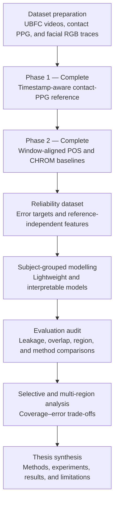

# rPPG Research Pipeline

Research code for a Computer Science Data Analytics master's thesis using the
local UBFC-rPPG dataset.

## Research Direction

This study investigates the reliability of classical remote
photoplethysmography (rPPG) heart-rate estimation. POS and CHROM can produce
accurate estimates in many video windows, but their errors are uneven across
subjects, facial regions, motion conditions, and signal-quality levels.
Reporting only an overall mean error therefore does not explain when an rPPG
estimate can be trusted.

The research treats reliability estimation as a data analytics problem. It
first constructs a timestamp-aware contact-PPG reference, then evaluates
standard POS and CHROM estimates across multiple facial regions. The resulting
window-level data will support lightweight and interpretable reliability
models using only reference-independent features, such as spectral quality,
face motion, ROI validity, cross-method agreement, and cross-region agreement.

The experimental design follows two constraints:

- validation must be grouped by subject so that windows from the same person
  cannot appear in both training and test data;
- the effects of evaluation choices, including overlapping windows and
  window-level random splitting, must be measured rather than ignored.

The intended research contribution is not a new commercial rPPG application.
It is an explainable framework for analysing when classical rPPG estimates are
reliable, together with evidence showing how evaluation design can bias
reported performance. Multi-region selection or fusion and selective
prediction will be evaluated only after the reliability baseline is
established.

### Dataset Source and Required Citation

This project uses Dataset 2 of the
[UBFC-rPPG dataset](https://sites.google.com/view/ybenezeth/ubfcrppg), recorded
by R. Macwan and Y. Benezeth and shared by the dataset authors for research
purposes. The videos and contact-PPG files are obtained from the official
dataset page and are not redistributed in this repository.

The official dataset page asks users to cite:

> S. Bobbia, R. Macwan, Y. Benezeth, A. Mansouri, and J. Dubois,
> "Unsupervised skin tissue segmentation for remote photoplethysmography,"
> *Pattern Recognition Letters*, vol. 124, pp. 82-90, 2019.
> https://doi.org/10.1016/j.patrec.2017.10.017

## Experimental Workflow



Phase 1 defines the reference independently of all rPPG errors. Phase 2 then
uses the exact Phase 1 timestamps to estimate POS and CHROM heart rates for
each facial region. Subsequent reliability models may use video, ROI, spectral,
cross-method, and cross-region features, but never the reference heart rate or
the resulting error as an input feature. All model evaluation will keep
subjects separated between training and test data.

## Current Status

| Phase | Status | Current result |
|---|---|---|
| Phase 1: contact-PPG reference | Complete | 42 subjects, 2,407 ten-second windows, 2,319 concordant primary windows |
| Phase 2: standard POS/CHROM baselines | Complete | Five facial regions, two methods, 24,070 window-level rows, 23,842 estimable rows |

The frozen methods and validation evidence are recorded in
[`docs/phase1_validation_report.md`](docs/phase1_validation_report.md) and
[`docs/phase2_validation_report.md`](docs/phase2_validation_report.md).

## Repository Structure

```text
rppg_pipeline/
  ubfc.py             UBFC subject discovery and ground-truth parsing
  ppg_reference.py    Phase 1 contact-PPG reference
  run_phase1.py       Phase 1 dataset runner
  standard_rppg.py    formal window-aligned POS/CHROM and Phase 2 features
  run_phase2.py       Phase 2 dataset runner
  video.py            video metadata
  face_landmarks.py   MediaPipe face landmarks
  roi.py              fixed facial ROIs
  rgb_trace.py        per-frame RGB and source-quality traces
  rppg.py             legacy full-segment CHROM/POS comparator
  evaluation.py       legacy coarse-grid evaluation comparator
  run_single.py       single-video preprocessing and legacy analysis
  run_batch.py        dataset preprocessing and legacy batch analysis
tests/
docs/
```

`standard_rppg.py` is the formal Phase 2 implementation. `rppg.py` and
`evaluation.py` are retained only as legacy comparators for the evaluation-bias
experiment.

## Environment Setup

```powershell
python -m venv .venv
.\.venv\Scripts\python.exe -m pip install -r requirements.txt
.\.venv\Scripts\python.exe -m pip install -r requirements-dev.txt
```

## Reproduce Phase 1

```powershell
.\.venv\Scripts\python.exe -m rppg_pipeline.run_phase1 `
  --dataset-root "<dataset-root>" `
  --out results_v2\phase1
```

## Reproduce Phase 2

Phase 2 reuses the RGB traces generated under `results/`.

```powershell
.\.venv\Scripts\python.exe -m rppg_pipeline.run_phase2 `
  --phase1-dir results_v2\phase1 `
  --trace-root results `
  --out results_v2\phase2
```
